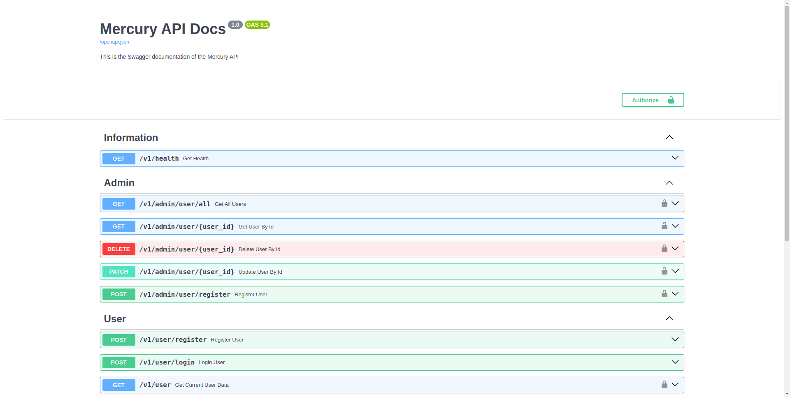

# Mercury
<p align="center">
     <br/>
    Start your Backend project faster than ever
</p>

<p align="center">
    
    
</p>

## Table of content

* [Introduction](#Introduction)
* [Setup](#setup)
* [Test the API](#test-the-api)
* [Test the database](#test-the-database)
* [How to add new SQL migrations](#how-to-add-new-sql-migrations)
* [Integration and Unit Testing](#integration-and-unit-testing)
* [Linter](#linter)
* [Security Scan](#security-scan)

## Introduction

Mercury is a simple and reliable boilerplate that anyone can use from beginners to experts (no deep bullsh*t).   

This project uses:  
- Basic [OAuth2](https://fastapi.tiangolo.com/tutorial/security/oauth2-jwt/?h=jwt) authentication, utilizing the FastAPI security module. It also supports user authentication via Google integration.
- [PostgreSQL](https://hub.docker.com/_/postgres) as its main database, [Redis](https://hub.docker.com/_/redis) for caching, and [flyway](https://hub.docker.com/r/flyway/flyway) for database migration.
- Unit and integration tests.
- Security scanner (Bandit).

### Project architecture

```
├── src
│ └── assets
│ └── constants
│ └── controllers
│     ├── admin
│     ├── user
│ └── database
│     ├── postgres_db.py
│     ├── redis_db.py
│ └── integration_tests
│ └── middleware
│     ├── auth_guard.py
│ └── migrations
│ └── models
│ └── routes
│     ├── admin
│     ├── user
│ └── schemas
│ └── unit_tests
│ └── utils
│ └── app.py
│ └── main.py
│ └── restful_ressources.py
```

## Setup
### Prerequisites

- [docker](https://www.docker.com)

### Environment variables

```shell
cp .env.dist .env
```

This will create a `.env` file in your project locally.

```shell
APP_TITLE="Mercury API Docs"
APP_DESCRIPTION="This is the Swagger documentation of the Mercury API"
APP_VERSION=1.0
API_URL="http://localhost:8000"
API_VERSION="v1"
APP_ENV=local
## Postgres Configuration
POSTGRES_HOST=mercury_db
POSTGRES_PASSWORD=mercury
POSTGRES_PORT=5432
POSTGRES_USER=mercury
POSTGRES_DB=mercury
POSTGRES_HOST_AUTH_METHOD=trust
POSTGRES_SIZE_POOL=30
POSTGRES_MAX_OVERFLOW=10
POSTGRES_POOL_TIMEOUT=30
POSTGRES_POOL_RECYCLE=1800
## Redis Configuration
REDIS_HOST=mercury_cache
REDIS_PORT=6379
## JWT Configuration
JWT_SECRET_KEY="mysecretkey"
JWT_ALGORITHM="HS256"
ACCESS_TOKEN_EXPIRE_MINUTES=30
## OIDC Configuration
OIDC_GOOGLE_CLIENT_ID="changeme"
OIDC_GOOGLE_CLIENT_SECRET="changeme"
GOOGLE_AUTH_URL="https://accounts.google.com/o/oauth2/auth"
GOOGLE_TOKEN_URL="https://accounts.google.com/o/oauth2/token"
GOOGLE_USER_INFO_URL="https://www.googleapis.com/oauth2/v1/userinfo"
```

### Run the containers

```shell
docker compose up --build --force-recreate
```

## Default admin account

Migrations seed one admin user so you can try the API and admin routes right away:

| Email           | Password  |
|-----------------|-----------|
| test@admin.com  | Cloud.456 |

Get a JWT by calling `POST /v1/token` with form body `username=test@admin.com` and `password=Cloud.456`, then use the returned `access_token` as `Authorization: Bearer <token>` for admin endpoints. Change or remove this user in production.

## Test the API

You can check the Swagger documentation on [localhost:8000](http://localhost:8000).



```shell
curl localhost:8000/v1/health
```

This will check the health of the API. The result should be like this:

```
{"alive":true, "status":"ok"}
```

## Test the database

```shell
docker exec -it mercury_db psql -U mercury
```

This command will take inside the postgreSQL database container where you can apply any SQL command you want.

```
psql (13.13 (Debian 13.13-1.pgdg120+1))
Type "help" for help.

mercury=# \d
        List of relations
 Schema | Name | Type  |  Owner  
--------+------+-------+---------
 public | user | table | mercury
```

## How to add new SQL migrations ?
One of the main principles of this project is to `Keep It Simple and Stupid`.  
That's why we do not have any fancy ORM package installed here.  
To add a new migration to your project simply add a new SQL file in the `migrations` folder along with the next version number at the beginning of file name. 
 
```shell
CREATE TABLE IF NOT EXISTS public.test (
    id uuid DEFAULT uuid_generate_v4() PRIMARY KEY,
    name VARCHAR(200)
);
-- This is an example where we create a test table. The new file name will be "V1.3__add_test_table"
```

If you want to know more you can check the [flyway db documentation](https://flywaydb.org).

## Integration and Unit Testing

One of important things that should be in every project is tests to keeps thing organized and make sure everything is working as intended.

### Integration tests
Here's how to run the integration test locally:  

```shell
docker compose up --build --abort-on-container-exit mercury_integration_tests
```

### Unit tests
Here's how to run the integration test locally:  

```shell
docker compose up --build --abort-on-container-exit mercury_unit_tests
```

## Linter

Having a fast linter can help avoiding coding style problems, and potentially avoid future bugs that takes long hours to fix.  
For the linter we're working with [ruff](https://astral.sh/ruff), a very fast linter written in Rust.

Here's how to run the linter test locally:

```shell
docker compose up --build --abort-on-container-exit mercury_linter
```

## Security Scan

For our project, we're using `bandit`, a tool designed to find common security issues in Python code. Here's how to run it locally:

```shell
docker compose up --build --abort-on-container-exit mercury_security
```

## Pre-commit

Install hooks locally to catch lint issues before CI:

```shell
pip install pre-commit
pre-commit install --install-hooks
pre-commit run --all-files
```

## How to add a new endpoint

1. **Flyway migration** — add `src/migrations/V{n}__description.sql` (next version number).
2. **Model** — add or update a SQLAlchemy model in `src/models/`.
3. **Schema** — add Pydantic request/response schemas in `src/schemas/`.
4. **Controller** — implement logic in `src/controllers/`.
5. **Route** — wire the endpoint in `src/routes/` and register it in `src/restful_ressources.py`.
6. **Tests** — add coverage under `src/integration_tests/` (and `src/unit_tests/` when appropriate).

Run `./ci/integration-test.sh` after changes.

-------

## Contributions

All contributions are welcome! Give a star if this project helped you!